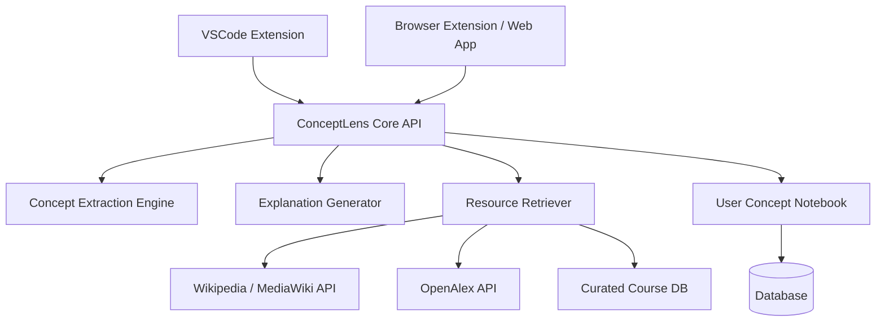
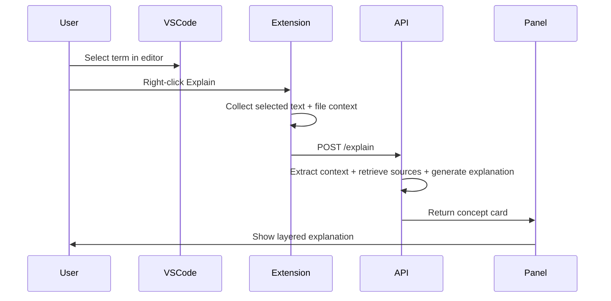
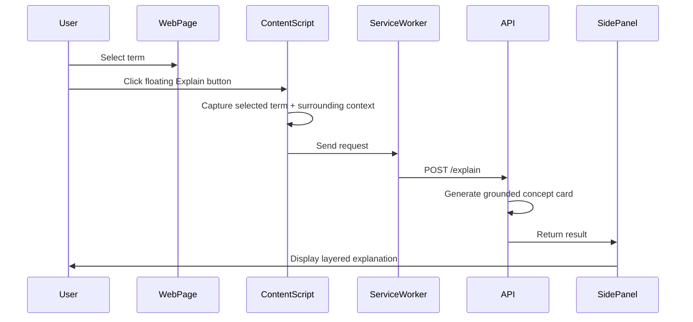
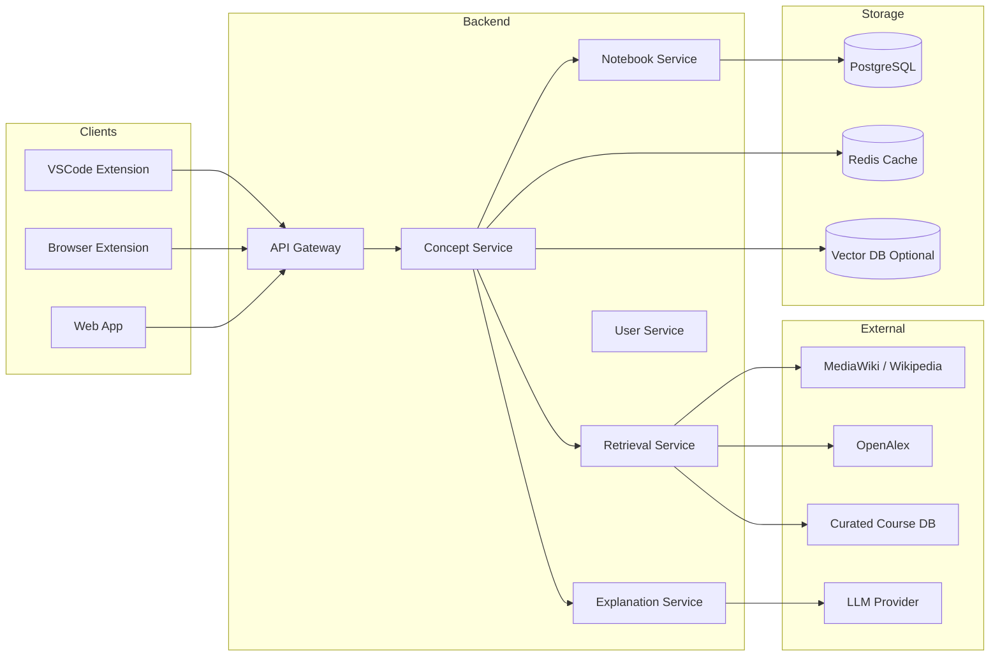
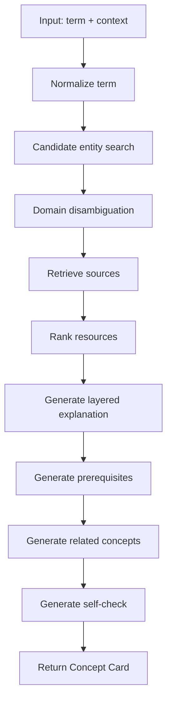

# ConceptLens 项目计划

> 项目类型：VSCode Extension + Web/Browser Extension  
> 项目定位：面向 AI 对话与技术文本的主动学习增强插件（AI learning companion / concept scaffolding layer）  
> 当前版本：v0.1 Project Plan  
> 维护目标：作为后续开发、MVP 拆分、论文/作品集展示与开源 README 的基础文档

---

## 1. 项目名称

## ConceptLens

### 命名理由

**ConceptLens** = Concept + Lens。  
它表达的是：用户不是直接接受 AI answer，而是通过一个“知识镜头”观察回答背后的 technical concepts、prerequisites、related fields 和 learning resources。

### 中文解释

**ConceptLens：概念透镜**

它不是一个普通的 dictionary，也不是单纯的 AI summarizer，而是一个在 AI 对话、代码阅读、论文阅读、技术文档阅读过程中，把陌生概念转化为可学习路径的工具。

### Slogan

> Don't just accept the answer. Understand the concepts behind it.

中文版本：

> 不只接受答案，而是理解答案背后的概念。

---

## 2. 项目背景

随着 ChatGPT、Claude、Gemini、Copilot、Cursor 等 AI tools 被广泛使用，很多用户在学习、写代码、查资料时逐渐形成了新的行为模式：

1. 遇到不懂的问题，直接让 AI 给答案。
2. 遇到陌生 technical term，默认相信 AI 的解释。
3. 不再主动搜索 Wikipedia、paper、course、documentation。
4. 对知识结构的理解变浅，形成 answer dependency。
5. 长期使用后，可能降低 critical thinking、concept exploration 和 independent learning 的动机。

ConceptLens 的目标不是反 AI，而是让 AI 使用过程重新具备学习属性。

它希望把：

```text
AI answer consumption
```

转化为：

```text
AI-assisted active learning
```

---

## 3. 核心问题定义

### 3.1 当前 AI 使用中的问题

| 问题 | 具体表现 |
|---|---|
| Passive acceptance | 用户直接相信 AI response，不验证来源 |
| Cognitive offloading | 用户把理解过程完全交给 AI |
| False mastery | 用户以为自己懂了，但只是看懂了表面解释 |
| Knowledge fragmentation | 用户记住零散术语，但没有领域结构 |
| Lack of resource path | AI 给了答案，但没有告诉用户系统学习路径 |
| Context ambiguity | 同一个词在不同领域含义不同，例如 `policy`、`embedding`、`transformer` |

### 3.2 ConceptLens 要解决的问题

ConceptLens 解决的不是“这个词是什么意思”，而是：

1. 这个 concept 在当前上下文里是什么意思？
2. 它属于哪个领域？
3. 理解它需要哪些 prerequisite concepts？
4. 它和哪些 related concepts 相关？
5. 用户应该看哪些 source 来建立更可靠的理解？
6. 用户是否真的理解了？

---

## 4. 产品定位

### 4.1 一句话定位

**ConceptLens 是一个面向 AI 对话、代码和技术文档的 contextual concept learning layer，用于识别陌生概念、生成分层解释、推荐学习资源，并帮助用户建立知识结构。**

### 4.2 不做什么

ConceptLens 不应该被设计成：

- 另一个 ChatGPT clone
- 普通划词翻译工具
- 单纯技术词典
- 自动替用户学习的 AI tutor
- 无来源的 AI explanation generator

### 4.3 应该做什么

ConceptLens 应该被设计成：

- AI conversation 中的 concept highlighter
- 技术文本中的 knowledge scaffold
- 学习路径生成器
- 概念 notebook
- 轻量级 self-check tool
- 面向工程师和学生的 AI literacy layer

---

## 5. 目标用户

### 5.1 Primary users

| 用户 | 场景 |
|---|---|
| CS / AI / Robotics students | 看 AI answer、论文、documentation 时遇到陌生概念 |
| Software developers | 阅读 codebase、issue、PR、API docs 时遇到不熟悉技术词 |
| Researchers | 阅读 paper abstract、related work、method section |
| Self-learners | 通过 AI 学习新领域，但希望避免过度依赖 AI |
| Educators / tutors | 希望学生不要只复制 AI answers，而是补齐知识点 |

### 5.2 用户画像示例

#### User A: AI/Robotics student

用户在 ChatGPT 中询问：

```text
How does diffusion policy improve robot manipulation?
```

AI 回答中包含：

```text
score matching, denoising diffusion, behavior cloning, action chunking, receding horizon control
```

用户不一定完全理解这些词。ConceptLens 会标记这些 concept，并生成：

- brief explanation
- technical explanation
- prerequisites
- related paper
- robotics course resource
- self-check question

#### User B: VSCode developer

用户在 VSCode 中阅读代码：

```python
class DataParallelPPOActor:
    def compute_log_prob(...)
```

ConceptLens 可解释：

- `log_prob`
- `PPO`
- `entropy regularization`
- `advantage estimation`
- `FSDP`
- `rollout`

并结合当前文件上下文说明它们在该 codebase 中的含义。

---

## 6. 产品形态

用户希望开发两个版本：

1. **VSCode Extension**
2. **Web / Browser Extension**

建议采用共享 backend + 共享 concept engine 的架构。



---

## 7. 两个版本的功能差异

## 7.1 VSCode Extension

### 主要场景

- 阅读代码
- 阅读 comments
- 阅读 Markdown docs
- 阅读 README
- 阅读 terminal output / error message
- 阅读 Copilot / Chat extension 的回答
- 阅读 academic codebase 中的 algorithm implementation

### 核心功能

| 功能 | 说明 | MVP 优先级 |
|---|---|---|
| Select-to-explain | 用户选中代码或术语，右键解释 | P0 |
| Explain current symbol | 对当前 cursor 下的 symbol 解释 | P0 |
| Concept side panel | 在 VSCode Webview 中显示解释 | P0 |
| Context-aware explanation | 使用当前文件上下文辅助 disambiguation | P0 |
| Save to notebook | 保存概念到本地/云端 notebook | P1 |
| Explain error terms | 解析 terminal error 中的 technical terms | P1 |
| Codebase glossary | 自动扫描 repo 并生成 glossary | P2 |
| Learning mode | 对当前 repo 自动生成 prerequisite map | P2 |

### VSCode UI 设计

建议提供 3 个入口：

1. **Right-click command**

```text
ConceptLens: Explain Selected Concept
```

2. **Command Palette**

```text
> ConceptLens: Explain Concept Under Cursor
> ConceptLens: Open Concept Panel
> ConceptLens: Generate Project Glossary
```

3. **Side Panel / Webview**

显示：

```text
Concept: Diffusion Policy

1. In this codebase
2. Brief explanation
3. Technical explanation
4. Prerequisites
5. Related concepts
6. Resources
7. Self-check
8. Save / Mark as learned
```

### VSCode Extension 技术路线

```text
Language: TypeScript
Runtime: Node.js
Extension API: VSCode Extension API
UI: Webview + React
Build: Vite / esbuild
State: VSCode globalState / workspaceState
Backend: ConceptLens Core API
Local cache: extension storage
```

### VSCode 关键 API

- `vscode.commands.registerCommand`
- `vscode.window.activeTextEditor`
- `editor.selection`
- `vscode.WebviewPanel`
- `vscode.TreeView`
- `vscode.workspace`
- `vscode.ExtensionContext.globalState`
- Optional: `vscode.LanguageModelChat` / VSCode Language Model API

### VSCode 版本 MVP Flow



---

## 7.2 Web / Browser Extension

### 主要场景

- ChatGPT / Claude / Gemini 对话
- 技术博客
- Wikipedia
- arXiv abstract
- GitHub README / issue / PR
- Documentation websites
- Online course notes

### 核心功能

| 功能 | 说明 | MVP 优先级 |
|---|---|---|
| Select-to-explain | 用户在网页中选中术语解释 | P0 |
| Context capture | 捕获术语前后文本作为上下文 | P0 |
| Browser side panel | 在浏览器右侧显示 concept card | P0 |
| Manual highlight | 用户手动保存术语并高亮 | P0 |
| Auto technical term detection | 自动标记技术词 | P1 |
| ChatGPT response analyzer | 分析一整条 AI answer 中的 concepts | P1 |
| Resource recommendation | Wikipedia / paper / course | P1 |
| Vocabulary notebook | 保存用户遇到的概念 | P1 |
| Cross-site learning history | 跨网页记录学习历史 | P2 |

### Browser Extension 技术路线

```text
Manifest: Chrome Extension Manifest V3
Language: TypeScript
UI: React + Tailwind
Page integration: content scripts
Background logic: service worker
Panel: Chrome sidePanel API
Messaging: chrome.runtime messaging / chrome.tabs messaging
State: chrome.storage.local / backend DB
```

### Browser Extension MVP Flow



### Web App 版本

除了 browser extension，也可以做一个独立 web app：

```text
https://conceptlens.app
```

Web app 用途：

- 管理 notebook
- 查看学习历史
- 搜索概念
- 查看 concept graph
- 复习 saved concepts
- 配置 API key
- 管理 resources
- 导出 Markdown / Anki / CSV

---

## 8. 核心功能设计

## 8.1 Concept Card

每个 concept card 是产品的核心内容单元。

### Concept Card 数据结构

```json
{
  "concept_id": "concept_diffusion_policy",
  "term": "Diffusion Policy",
  "detected_language": "en",
  "domain": "Robotics / Machine Learning",
  "context_source": "ChatGPT / VSCode / Webpage",
  "context_snippet": "...",
  "confidence": 0.86,
  "brief": "...",
  "intuitive_explanation": "...",
  "technical_explanation": "...",
  "why_it_matters_here": "...",
  "prerequisites": [
    "Behavior Cloning",
    "Diffusion Models",
    "Trajectory Prediction"
  ],
  "related_concepts": [
    "Imitation Learning",
    "Score Matching",
    "Receding Horizon Control"
  ],
  "resources": [
    {
      "title": "Wikipedia: Diffusion model",
      "type": "wikipedia",
      "url": "...",
      "level": "beginner"
    },
    {
      "title": "Diffusion Policy paper",
      "type": "paper",
      "url": "...",
      "level": "advanced"
    }
  ],
  "self_check": [
    {
      "question": "Why is diffusion useful for modeling multimodal robot actions?",
      "expected_answer": "..."
    }
  ],
  "created_at": "2026-04-28T00:00:00Z"
}
```

### Concept Card UI

```text
┌──────────────────────────────────────┐
│ Diffusion Policy                      │
│ Domain: Robotics / Imitation Learning │
├──────────────────────────────────────┤
│ 1. Brief                              │
│ 2. Intuitive                          │
│ 3. Technical                          │
│ 4. Why it matters here                │
│ 5. Prerequisites                      │
│ 6. Related Concepts                   │
│ 7. Resources                          │
│ 8. Self-check                         │
└──────────────────────────────────────┘
```

---

## 8.2 Explanation Levels

### Level 1: Brief

目标：一句话解释，快速建立基本理解。

```text
Diffusion Policy is a robot control method that uses diffusion models to generate action sequences from visual observations.
```

### Level 2: Intuitive

目标：用直观类比解释，但不能过度简化。

```text
It works like gradually refining noisy action guesses into a clean and executable robot trajectory.
```

### Level 3: Technical

目标：给有基础的用户提供更准确的 technical description。

```text
Diffusion Policy formulates visuomotor policy learning as conditional denoising diffusion over action trajectories, typically trained through behavior cloning on demonstration data.
```

### Level 4: In this context

目标：解释该词在当前 AI answer / code file / webpage 中的具体含义。

```text
In this answer, Diffusion Policy is mentioned as the action head for VLA systems, meaning it maps visual-language features to continuous robot action trajectories.
```

---

## 8.3 Resource Recommendation

资源分层：

| Level | Resource Type | Example |
|---|---|---|
| Beginner | Wikipedia / explainer article | Wikipedia page |
| Intermediate | Course note / lecture | CS231n, MIT OCW, Stanford CS224N |
| Advanced | Paper / documentation | arXiv, OpenAlex, official docs |
| Practical | Code / tutorial | GitHub repo, official examples |

### Resource ranking factors

```text
score = source_authority
      + context_similarity
      + difficulty_match
      + recency
      + citation_count
      + user_preference_match
```

---

## 8.4 Concept Notebook

用户可以保存 concept：

```text
Saved
Learning
Reviewed
Mastered
Ignored
```

Notebook 字段：

```json
{
  "user_id": "local_user",
  "concept_id": "concept_transformer",
  "status": "learning",
  "source": "chatgpt",
  "first_seen_at": "2026-04-28T10:00:00Z",
  "last_reviewed_at": null,
  "review_count": 0,
  "user_note": "Need to understand attention mechanism first."
}
```

### Notebook 用途

- 记录用户常见知识盲区
- 生成 personalized learning path
- 做 spaced repetition
- 导出 Markdown / Anki
- 给后续推荐系统提供用户偏好

---

## 8.5 Self-check

每个 concept card 生成 1-2 个问题。

### 示例

Concept: `policy gradient`

```text
Q1: In reinforcement learning, why can policy gradient methods optimize stochastic policies directly?

Q2: What is the difference between optimizing a value function and optimizing a policy?
```

目标不是考试，而是防止用户产生 false mastery。

---

## 9. 系统架构

## 9.1 总体架构



---

## 9.2 ConceptLens Core Pipeline



---

## 10. Backend API Design

## 10.1 POST /api/explain

### Request

```json
{
  "term": "diffusion policy",
  "context": "In VLA systems, diffusion policy can be used as an action head...",
  "source": {
    "client": "vscode",
    "url": null,
    "file_path": "verl/workers/actor.py",
    "language": "python"
  },
  "user_preferences": {
    "level": "intermediate",
    "domains": ["robotics", "machine_learning"],
    "language": "zh-CN-with-english-technical-terms"
  }
}
```

### Response

```json
{
  "concept_card": {
    "term": "Diffusion Policy",
    "domain": "Robotics / Imitation Learning",
    "brief": "...",
    "intuitive_explanation": "...",
    "technical_explanation": "...",
    "why_it_matters_here": "...",
    "prerequisites": [],
    "related_concepts": [],
    "resources": [],
    "self_check": []
  }
}
```

---

## 10.2 POST /api/extract-concepts

用于自动检测一段 AI answer / README / article 中的 technical concepts。

### Request

```json
{
  "text": "Diffusion policy uses denoising diffusion models for visuomotor control...",
  "source": "web",
  "max_terms": 10,
  "domain_hint": "robotics"
}
```

### Response

```json
{
  "concepts": [
    {
      "term": "Diffusion Policy",
      "confidence": 0.94,
      "span": [0, 16],
      "domain": "Robotics"
    },
    {
      "term": "denoising diffusion models",
      "confidence": 0.91,
      "span": [22, 48],
      "domain": "Machine Learning"
    }
  ]
}
```

---

## 10.3 POST /api/save-concept

### Request

```json
{
  "user_id": "local_user",
  "concept_id": "concept_diffusion_policy",
  "status": "learning",
  "note": "Need to revisit diffusion model basics."
}
```

---

## 10.4 GET /api/notebook

返回用户保存过的 concepts。

---

## 10.5 GET /api/concepts/:id/graph

返回 concept 的 prerequisites 和 related concepts。

---

## 11. 数据库设计

## 11.1 users

```sql
CREATE TABLE users (
    id UUID PRIMARY KEY,
    email TEXT UNIQUE,
    created_at TIMESTAMP DEFAULT NOW(),
    default_language TEXT DEFAULT 'zh-CN',
    default_level TEXT DEFAULT 'intermediate'
);
```

## 11.2 concepts

```sql
CREATE TABLE concepts (
    id UUID PRIMARY KEY,
    canonical_term TEXT NOT NULL,
    domain TEXT,
    description TEXT,
    wikidata_id TEXT,
    wikipedia_url TEXT,
    openalex_topic_id TEXT,
    created_at TIMESTAMP DEFAULT NOW()
);
```

## 11.3 concept_aliases

```sql
CREATE TABLE concept_aliases (
    id UUID PRIMARY KEY,
    concept_id UUID REFERENCES concepts(id),
    alias TEXT NOT NULL,
    language TEXT
);
```

## 11.4 concept_cards

```sql
CREATE TABLE concept_cards (
    id UUID PRIMARY KEY,
    concept_id UUID REFERENCES concepts(id),
    context_hash TEXT,
    source_type TEXT,
    brief TEXT,
    intuitive_explanation TEXT,
    technical_explanation TEXT,
    why_it_matters_here TEXT,
    generated_at TIMESTAMP DEFAULT NOW()
);
```

## 11.5 resources

```sql
CREATE TABLE resources (
    id UUID PRIMARY KEY,
    concept_id UUID REFERENCES concepts(id),
    title TEXT NOT NULL,
    url TEXT NOT NULL,
    resource_type TEXT,
    level TEXT,
    source TEXT,
    authority_score FLOAT,
    created_at TIMESTAMP DEFAULT NOW()
);
```

## 11.6 user_concepts

```sql
CREATE TABLE user_concepts (
    id UUID PRIMARY KEY,
    user_id UUID REFERENCES users(id),
    concept_id UUID REFERENCES concepts(id),
    status TEXT DEFAULT 'saved',
    user_note TEXT,
    first_seen_at TIMESTAMP DEFAULT NOW(),
    last_reviewed_at TIMESTAMP,
    review_count INTEGER DEFAULT 0
);
```

---

## 12. Term Extraction Strategy

## 12.1 MVP: Hybrid Rule + LLM

MVP 阶段不需要训练模型，建议使用 hybrid approach：

1. Rule-based candidate extraction
2. Domain keyword matching
3. LLM-based filtering
4. Context-aware disambiguation

### Candidate patterns

```text
- Capitalized technical phrases: "Diffusion Policy", "Monte Carlo Tree Search"
- Hyphenated terms: "self-supervised", "vision-language-action"
- Acronyms: "PPO", "GRPO", "VLA", "FSDP"
- Code symbols: class/function/module names
- Noun phrases: "latent representation", "policy gradient"
```

### LLM prompt 目标

输入：

```text
selected term + surrounding context
```

输出：

```json
{
  "is_technical_concept": true,
  "canonical_term": "...",
  "domain": "...",
  "ambiguity": "...",
  "confidence": 0.0
}
```

---

## 12.2 后续版本：Embedding + Entity Linking

第二阶段可以加入：

- `sentence-transformers`
- SciBERT / SPECTER-style embeddings
- Wikidata entity linking
- OpenAlex topic mapping
- vector database
- user-specific domain preference

---

## 13. Explanation Generation Strategy

## 13.1 Grounded Generation

原则：

```text
Retrieve first, generate second.
```

不要让 LLM 直接生成无来源解释。流程应该是：

1. Search Wikipedia / MediaWiki
2. Search OpenAlex works / topics
3. Retrieve curated course resources
4. Build context package
5. Ask LLM to generate layered explanation using retrieved source snippets
6. Return explanation + source list

## 13.2 Prompt Template

```text
You are ConceptLens, a learning assistant.

Task:
Explain the selected concept in the user's current context.

Inputs:
- Term: {{term}}
- Context: {{context}}
- Domain hint: {{domain_hint}}
- Retrieved sources: {{sources}}
- User level: {{level}}

Output JSON:
{
  "canonical_term": "...",
  "domain": "...",
  "brief": "...",
  "intuitive_explanation": "...",
  "technical_explanation": "...",
  "why_it_matters_here": "...",
  "prerequisites": [],
  "related_concepts": [],
  "resources": [],
  "self_check": []
}

Rules:
- Do not invent facts not supported by sources.
- If the term is ambiguous, explain the most likely meaning in this context.
- Use clear language.
- Keep technical terms in English.
- Do not over-simplify mathematical or engineering concepts.
```

---

## 14. Privacy and Security

## 14.1 Privacy Principles

ConceptLens 可能读取网页文本和代码上下文，因此必须严格控制权限。

### 默认策略

| 数据 | 默认行为 |
|---|---|
| Selected term | 可以发送到 backend |
| Surrounding context | 只发送有限窗口，例如前后 500-1000 characters |
| Full webpage | 默认不发送 |
| Full codebase | 默认不发送 |
| API keys | 本地加密存储 |
| User notebook | 用户可选择 local-only 或 cloud sync |
| Chat history | 默认不保存完整 conversation |

### 用户设置

```text
[ ] Send selected text only
[ ] Send surrounding context
[ ] Enable auto concept detection
[ ] Save concept history locally
[ ] Sync concept history to cloud
[ ] Use local LLM if available
```

---

## 14.2 Browser Extension Permission Design

MVP 权限应尽量小：

```json
{
  "permissions": [
    "storage",
    "contextMenus",
    "sidePanel",
    "activeTab"
  ],
  "host_permissions": [
    "<all_urls>"
  ]
}
```

更保守版本：

```json
{
  "permissions": [
    "storage",
    "contextMenus",
    "sidePanel",
    "activeTab"
  ],
  "optional_host_permissions": [
    "https://chat.openai.com/*",
    "https://chatgpt.com/*",
    "https://claude.ai/*",
    "https://gemini.google.com/*",
    "https://github.com/*",
    "https://arxiv.org/*"
  ]
}
```

建议优先采用 optional permissions，降低用户疑虑。

---

## 15. Repo Structure

建议 monorepo：

```text
conceptlens/
├── README.md
├── PROJECT_PLAN.md
├── package.json
├── pnpm-workspace.yaml
├── apps/
│   ├── vscode-extension/
│   │   ├── package.json
│   │   ├── src/
│   │   │   ├── extension.ts
│   │   │   ├── commands/
│   │   │   ├── panels/
│   │   │   ├── services/
│   │   │   └── utils/
│   │   └── webview-ui/
│   ├── browser-extension/
│   │   ├── manifest.json
│   │   ├── src/
│   │   │   ├── content/
│   │   │   ├── background/
│   │   │   ├── sidepanel/
│   │   │   └── shared/
│   │   └── public/
│   ├── web-app/
│   │   ├── src/
│   │   └── app/
│   └── api/
│       ├── src/
│       │   ├── routes/
│       │   ├── services/
│       │   ├── retrievers/
│       │   ├── prompts/
│       │   └── db/
│       └── prisma/
├── packages/
│   ├── core/
│   │   ├── concept-extraction/
│   │   ├── explanation/
│   │   ├── resource-ranking/
│   │   └── types/
│   ├── ui/
│   └── config/
└── docs/
    ├── architecture.md
    ├── api.md
    ├── privacy.md
    └── roadmap.md
```

---

## 16. 技术栈建议

## 16.1 Shared

```text
Language: TypeScript
Package manager: pnpm
Monorepo: pnpm workspace / Turborepo
Schema validation: Zod
Testing: Vitest
Linting: ESLint + Prettier
```

## 16.2 Backend

```text
Option A: Node.js + Fastify / Hono / Next.js API
Option B: Python + FastAPI

Recommended for MVP:
- FastAPI if NLP pipeline is Python-heavy
- Next.js API if frontend-heavy and deployment speed matters
```

建议：

```text
MVP: FastAPI + PostgreSQL + Redis optional
```

理由：

- Python ecosystem 更适合 NLP / embedding / retrieval
- FastAPI 写 API 快
- 后续接 local models 更自然

## 16.3 Frontend

```text
React
TypeScript
Tailwind CSS
shadcn/ui optional
```

## 16.4 VSCode Extension

```text
TypeScript
VSCode Extension API
Webview + React
esbuild / Vite
```

## 16.5 Browser Extension

```text
Manifest V3
TypeScript
React side panel
Content script
Service worker
chrome.storage
```

## 16.6 Storage

MVP：

```text
Local: chrome.storage.local / VSCode globalState
Cloud: PostgreSQL
```

Later：

```text
Vector DB: pgvector / Qdrant / Chroma
Cache: Redis
```

---

## 17. Development Roadmap

## Phase 0: Project Setup

目标：完成基础 repo、开发环境和最小 API skeleton。

### Tasks

- [ ] 创建 monorepo
- [ ] 初始化 `apps/api`
- [ ] 初始化 `apps/vscode-extension`
- [ ] 初始化 `apps/browser-extension`
- [ ] 初始化 shared `packages/core`
- [ ] 定义 TypeScript types / Python pydantic schemas
- [ ] 配置 lint/test/build
- [ ] 编写 README 和开发说明

### Deliverables

- 可运行 API skeleton
- VSCode Hello World command
- Browser Extension side panel skeleton

---

## Phase 1: Core MVP - Manual Select-to-Explain

目标：实现最核心闭环。

### VSCode

- [ ] 选中文本
- [ ] 右键 `ConceptLens: Explain Selected Concept`
- [ ] 获取当前文件上下文
- [ ] 调用 `/api/explain`
- [ ] 在 Webview panel 显示 concept card

### Browser

- [ ] content script 获取 selected text
- [ ] 显示 floating explain button
- [ ] 调用 background service worker
- [ ] 打开 side panel
- [ ] 显示 concept card

### Backend

- [ ] `/api/explain`
- [ ] Wikipedia search
- [ ] OpenAlex search
- [ ] LLM layered explanation
- [ ] 基础 resource ranking

### Deliverables

- 用户选中一个术语后，可以在 VSCode 和网页右侧看到解释卡片。

---

## Phase 2: Notebook and Learning State

目标：让用户能保存和回顾 concepts。

### Tasks

- [ ] Save concept
- [ ] Mark as learning / mastered / ignored
- [ ] Local storage support
- [ ] Web app notebook page
- [ ] Export Markdown
- [ ] Add user notes
- [ ] Basic search in notebook

### Deliverables

- 用户可以保存概念并形成自己的 learning notebook。

---

## Phase 3: Auto Concept Detection

目标：从手动选词升级到半自动 detection。

### Tasks

- [ ] `/api/extract-concepts`
- [ ] Browser page-level concept extraction
- [ ] ChatGPT answer-level concept extraction
- [ ] VSCode file-level glossary extraction
- [ ] Highlight detected terms
- [ ] Confidence threshold setting
- [ ] Ignore list / known concepts list

### Deliverables

- 插件能自动标记一段 AI response / code file 中的高价值 technical terms。

---

## Phase 4: Concept Graph and Learning Path

目标：从解释卡片升级为知识结构。

### Tasks

- [ ] Build prerequisite graph
- [ ] Related concepts graph visualization
- [ ] Personalized learning path
- [ ] Domain map
- [ ] Review recommendation
- [ ] Spaced repetition
- [ ] Quiz generation

### Deliverables

- 用户能看到自己学习某个领域需要补齐的 concept graph。

---

## Phase 5: Public Beta

目标：发布可试用版本。

### Tasks

- [ ] Chrome Web Store packaging
- [ ] VSCode Marketplace packaging
- [ ] Privacy policy
- [ ] Landing page
- [ ] Tutorial video / GIF
- [ ] Feedback form
- [ ] Analytics with privacy-safe events
- [ ] Error monitoring

### Deliverables

- Chrome Extension beta
- VSCode Extension beta
- Web app beta
- Landing page

---

## 18. MVP 开发时间表

如果是个人开发，建议按 6 周 MVP 规划。

| Week | 目标 | 输出 |
|---|---|---|
| Week 1 | repo + API + UI skeleton | monorepo, extension skeletons |
| Week 2 | backend concept explanation pipeline | `/api/explain`, Wikipedia/OpenAlex retrieval |
| Week 3 | browser extension select-to-explain | side panel card 可用 |
| Week 4 | VSCode extension select-to-explain | Webview card 可用 |
| Week 5 | notebook + save concept | local/cloud save |
| Week 6 | polish + demo + docs | demo video, README, publish-ready package |

---

## 19. MVP Success Metrics

### Product metrics

| 指标 | 目标 |
|---|---|
| Time to first explanation | < 5 seconds |
| Explanation usefulness rating | > 4/5 |
| Source click-through rate | > 20% |
| Save concept rate | > 15% |
| Self-check completion rate | > 10% |
| Repeat usage | 用户一周内使用 > 3 次 |

### Learning metrics

| 指标 | 解释 |
|---|---|
| User can explain concept after reading | 简单 self-report |
| User clicks prerequisite concept | 表明开始拓展知识 |
| User saves related resources | 表明不是只消费答案 |
| User revisits saved concepts | 表明 notebook 有价值 |

---

## 20. Evaluation Design

如果后续想把项目扩展成 research project，可以做 user study。

### Research Questions

1. ConceptLens 是否能减少用户对 AI answer 的 passive acceptance？
2. ConceptLens 是否能提升用户对 technical terms 的理解准确率？
3. ConceptLens 是否能增加用户主动点击 external resources 的比例？
4. ConceptLens 是否能帮助用户形成更完整的 knowledge structure？

### Study Design

```text
Participants: 20-40 students / developers

Groups:
- Control: normal AI chat
- Treatment: AI chat + ConceptLens

Tasks:
- Learn a new technical topic
- Read AI-generated explanation
- Answer concept understanding questions
- Explain terms in their own words
- Select resources they would continue reading

Metrics:
- comprehension score
- misconception rate
- external resource usage
- confidence calibration
- retention after 1 week
```

---

## 21. Risks and Mitigation

## 21.1 Product Risks

| Risk | Impact | Mitigation |
|---|---|---|
| 用户觉得插件打扰阅读 | 高 | 默认手动选词，自动高亮作为 opt-in |
| 解释太长 | 中 | 使用 layered explanation，默认显示 brief |
| 和普通词典差异不明显 | 高 | 强调 context + prerequisites + resources + self-check |
| 用户不愿意安装 extension | 中 | 提供 web app / bookmarklet demo |
| 资源推荐质量差 | 高 | 先用 curated resource list + trusted APIs |

## 21.2 Technical Risks

| Risk | Impact | Mitigation |
|---|---|---|
| Term disambiguation 错误 | 高 | 使用 surrounding context + domain hint |
| Browser DOM 结构变化 | 中 | 优先使用 selection API，不依赖 ChatGPT 内部 DOM |
| VSCode Webview 开发复杂 | 中 | 先做简单 HTML，再接 React |
| LLM 成本过高 | 中 | cache concept card，复用 common concepts |
| API latency 高 | 中 | source cache + streaming UI + local fallback |

## 21.3 Privacy Risks

| Risk | Impact | Mitigation |
|---|---|---|
| 用户代码被上传 | 高 | 默认只上传 selected term + small context |
| 用户聊天内容泄露 | 高 | 明确 consent，支持 local-only mode |
| extension 权限过大 | 高 | 使用 optional permissions 和 activeTab |
| API key 暴露 | 高 | 不在 frontend hardcode key，backend proxy |

---

## 22. Versioning Plan

## v0.1 Internal Demo

- Browser select-to-explain
- VSCode select-to-explain
- Static concept card UI
- Simple backend explanation

## v0.2 MVP

- Wikipedia/OpenAlex retrieval
- Layered explanation
- Save concept
- Local notebook

## v0.3 Alpha

- Auto concept extraction
- Highlight technical terms
- Resource ranking
- Export Markdown

## v0.4 Beta

- User account
- Cloud sync
- Concept graph
- Self-check

## v1.0 Public Release

- Chrome Web Store
- VSCode Marketplace
- Privacy policy
- Stable API
- Landing page
- Feedback loop

---

## 23. Competitive Differentiation

| Tool 类型 | 现有能力 | ConceptLens 差异 |
|---|---|---|
| Dictionary extension | 解释单词 | ConceptLens 解释上下文中的 technical concept |
| ChatGPT | 直接回答 | ConceptLens 强制加入 source + prerequisite + self-check |
| Readwise / Notion | 保存笔记 | ConceptLens 自动结构化 concept notebook |
| GitHub Copilot | 辅助写代码 | ConceptLens 帮助理解代码背后的概念 |
| Wikipedia | 提供百科 | ConceptLens 把百科映射到当前上下文 |
| Paper assistant | 总结论文 | ConceptLens 提取并组织陌生概念 |

---

## 24. Branding

### Main name

```text
ConceptLens
```

### Sub-products

```text
ConceptLens for Web
ConceptLens for VSCode
ConceptLens Notebook
ConceptLens Graph
```

### Alternative names

如果后续想换名字，可考虑：

```text
LearnLayer
TermBridge
KnowledgeLens
ConceptBridge
AIGloss
ContextScholar
```

但当前最推荐 **ConceptLens**，因为它简洁、技术感强、适合 extension 和 developer tool。

---

## 25. Initial README Draft

```markdown
# ConceptLens

ConceptLens is an AI learning companion for VSCode and the Web.  
It helps users identify unfamiliar technical concepts in AI conversations, code, documentation, and research articles, then turns them into structured learning cards with explanations, prerequisites, related concepts, resources, and self-check questions.

## Why

AI tools make it easy to get answers, but they can also make users skip the learning process. ConceptLens helps users move from passive answer consumption to active concept learning.

## Features

- Select-to-explain technical concepts
- Context-aware layered explanations
- Wikipedia / paper / course resources
- Prerequisite and related concept mapping
- Personal concept notebook
- VSCode extension
- Browser extension

## Status

Early project planning / MVP development.
```

---

## 26. First Implementation Checklist

### Backend

- [ ] Create `POST /api/explain`
- [ ] Implement Wikipedia search
- [ ] Implement OpenAlex search
- [ ] Implement prompt template
- [ ] Return mock concept card
- [ ] Add caching

### Browser Extension

- [ ] Setup Manifest V3
- [ ] Add content script
- [ ] Detect selected text
- [ ] Add context menu
- [ ] Add side panel
- [ ] Call backend
- [ ] Render concept card

### VSCode Extension

- [ ] Create extension scaffold
- [ ] Register command
- [ ] Read selected text
- [ ] Read file context
- [ ] Open WebviewPanel
- [ ] Call backend
- [ ] Render concept card

### Web App

- [ ] Landing page
- [ ] Notebook page
- [ ] Concept detail page
- [ ] Settings page

---

## 27. 开发优先级建议

最建议的开发顺序：

```text
1. Backend /api/explain with mock data
2. Shared ConceptCard UI component
3. Browser Extension select-to-explain
4. VSCode Extension select-to-explain
5. Real retrieval: Wikipedia + OpenAlex
6. Notebook
7. Auto extraction
8. Concept graph
```

原因：

- Browser extension 更快展示 product value。
- VSCode extension 更适合作为 developer-focused differentiation。
- Backend 和 UI component 共享后，两个客户端开发成本会降低。
- Auto extraction 不要太早做，否则会被 false positives 拖慢。

---

## 28. 关键设计原则

1. **Manual first, automatic later**  
   先做用户主动选词，后做自动检测。

2. **Context-aware, not dictionary-only**  
   必须解释当前上下文中的含义。

3. **Source-grounded, not pure LLM**  
   先 retrieval，再 generation。

4. **Learning-oriented, not answer-oriented**  
   加入 prerequisite、resources、self-check。

5. **Privacy-first**  
   默认只处理 selected text 和有限 context。

6. **Progressive disclosure**  
   默认短解释，用户需要时再展开 technical details。

7. **Cross-platform core**  
   VSCode 和 Browser 共享 backend、types、UI 和 concept engine。

---

## 29. 官方技术参考

### VSCode

- VSCode Extension API: https://code.visualstudio.com/api
- VSCode Webview API: https://code.visualstudio.com/api/extension-guides/webview
- VSCode Language Model API: https://code.visualstudio.com/api/extension-guides/ai/language-model
- VSCode UX Guidelines for Webviews: https://code.visualstudio.com/api/ux-guidelines/webviews

### Browser Extension

- Chrome Extension Content Scripts: https://developer.chrome.com/docs/extensions/develop/concepts/content-scripts
- Chrome Extension Messaging: https://developer.chrome.com/docs/extensions/develop/concepts/messaging
- Chrome Side Panel API: https://developer.chrome.com/docs/extensions/reference/api/sidePanel
- MDN WebExtensions Content Scripts: https://developer.mozilla.org/en-US/docs/Mozilla/Add-ons/WebExtensions/Content_scripts
- MDN WebExtensions Sidebars: https://developer.mozilla.org/en-US/docs/Mozilla/Add-ons/WebExtensions/user_interface/Sidebars

### Knowledge APIs

- MediaWiki REST API: https://www.mediawiki.org/wiki/API:REST_API
- MediaWiki Search API: https://www.mediawiki.org/wiki/API:Search
- OpenAlex API Overview: https://developers.openalex.org/api-reference/introduction
- OpenAlex Topics: https://developers.openalex.org/api-reference/topics
- OpenAlex Works: https://developers.openalex.org/api-reference/works

---

## 30. 最终总结

ConceptLens 的核心价值是：

```text
把 AI 回答中的陌生概念，转化为可理解、可追踪、可复习、可拓展的学习单元。
```

对于 Web 版本，它解决的是：

```text
用户在 AI chat / article / documentation 中遇到技术概念时如何继续学习。
```

对于 VSCode 版本，它解决的是：

```text
开发者在阅读代码、错误信息和技术文档时如何理解背后的概念。
```

最小可行产品应该坚持：

```text
Select term → Explain in context → Show sources → Save concept → Self-check
```

不要一开始追求全自动。  
ConceptLens 的第一版只要把这个闭环做顺，就已经有足够清晰的产品价值和开发展示价值。
