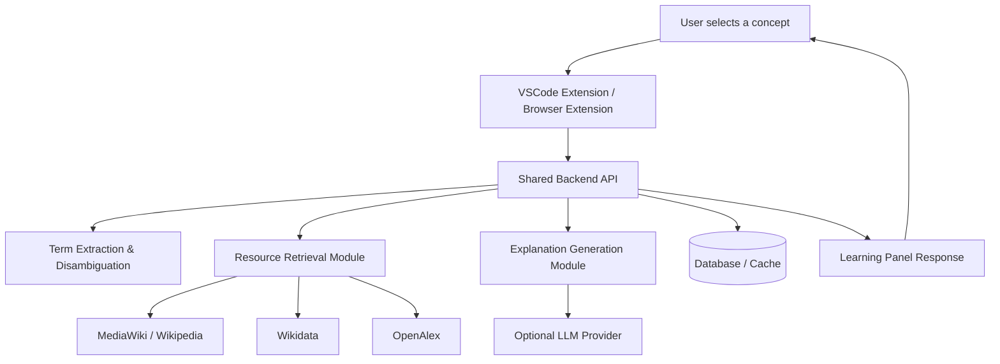

# ConceptLens / 概念透镜

ConceptLens（概念透镜）旨在把 AI answer consumption 转化为 AI-assisted active learning。
ConceptLens is a contextual concept learning layer for AI conversations, code reading, and technical documents.

> 当前状态：项目规划与早期开发阶段，尚未实现 VSCode Extension、Browser Extension、backend API 或数据库。  
> Status: Planning / early development stage.

## 中文简介

在使用 ChatGPT、Claude、Gemini、Copilot、Cursor 等 AI tools 时，用户很容易形成 cognitive offloading：遇到不懂的 technical concept 时直接接受 AI answer，而不是主动验证 source、理解 prerequisites、扩展 related concepts，或检查自己是否真的理解。

ConceptLens 想解决的不是“把一个词翻译一下”，而是帮助用户在 AI conversation、code、documentation、paper、technical blog 中识别陌生概念，并把这些概念转化为可学习、可追踪、可复习的结构化 learning pathway。

核心目标：

- 减少 passive acceptance 和 false mastery
- 鼓励 source verification，而不是无来源地相信 generated explanation
- 帮助用户理解 technical term 在当前 context 中的具体含义
- 组织 prerequisites、related concepts、resources 和 self-check questions
- 让 AI 使用过程保留主动学习和 critical thinking

## English Overview

AI tools make it easy to get answers, but they can also make users skip the learning process. Users may accept unfamiliar technical terms at face value, rely on AI explanations without source verification, and miss the prerequisite knowledge needed for real understanding.

ConceptLens is designed to turn passive AI answer consumption into active concept learning. It helps users identify unfamiliar concepts in AI conversations, source code, documentation, research papers, and technical articles, then organizes them into structured learning cards with layered explanations, prerequisites, related concepts, resources, and self-check questions.

The project is currently a plan and early development foundation, not a completed product.

## Project Vision / 项目愿景

ConceptLens 不是普通 dictionary plugin，也不是另一个 ChatGPT clone。它的定位是 AI conversation learning layer / contextual learning companion。

它希望成为用户阅读 AI answers、code、technical documents 时的 concept scaffolding layer：

- 解释当前 context 中的 concept，而不是只给通用定义
- 先 retrieval，再 generation，避免纯 LLM hallucination
- 默认从 brief explanation 开始，再逐步展开 intuitive / technical details
- 将 explanation 与 prerequisites、resources、self-check 连接起来
- 让用户继续学习，而不是让插件替用户思考

ConceptLens is not a generic dictionary plugin or a chatbot clone. It is a contextual learning companion that sits beside AI conversations, source code, and technical documents. Its role is to expose the concepts behind an answer, connect them to reliable sources and prerequisite knowledge, and help users check whether they actually understand them.

## Core Idea / 核心想法

计划 workflow：

1. 用户在 AI conversation / code / webpage / documentation 中遇到陌生 technical term。
2. 用户手动选择 term，或在后续版本中由系统自动检测 technical concepts。
3. ConceptLens 在 side panel、web page 或 VSCode Webview panel 中展示 concept card。
4. Concept card 提供 layered explanation：brief、intuitive、technical，以及 why it matters here。
5. Concept card 继续提供 prerequisites、related concepts、resources 和 self-check questions。
6. 用户可以将 concept 保存到 notebook，并在后续版本中形成 personalized learning path。

In English, the core loop is:

```text
Select term -> Explain in context -> Show sources -> Save concept -> Self-check
```

The first version should prioritize the manual `Select-to-explain` loop before automatic detection or personalization.

## Planned Platforms / 计划支持平台

### VSCode Extension version / VSCode Extension 版本

面向场景：

- code reading
- documentation reading
- README / Markdown reading
- terminal output / error message reading
- AI coding assistant output
- academic codebase and algorithm implementation reading

Planned capabilities / 计划能力：

- `Select-to-explain` for selected code or selected term
- Explain current symbol under cursor
- Context-aware explanation using current file context
- Concept side panel through VSCode Webview
- Possible inline explanation and annotations in later phases
- Local cache through extension storage

This version is intended for developers and students who want to understand the concepts behind code, APIs, models, algorithms, and errors.

### Web / Browser Extension version / Web 与 Browser Extension 版本

面向场景：

- ChatGPT
- Claude
- Gemini
- Perplexity
- technical blogs
- documentation websites
- GitHub README / issue / PR
- Wikipedia
- arXiv abstract
- online course notes

Planned capabilities / 计划能力：

- selected term explanation
- highlighted technical terms in later phases
- side panel explanation through Chrome sidePanel API
- limited context capture around selected text
- manual highlight and vocabulary notebook
- optional auto technical term detection in later phases

This version is intended for users who want to keep learning while reading AI answers, articles, and technical documentation in the browser.

## Planned Features / 计划功能

除非明确说明，否则下面所有功能都处于 planned 状态。当前 repository 尚未包含对应实现。

All items below are planned unless explicitly marked otherwise. This repository does not yet contain the implementation.

### MVP / 最小可行功能

- [ ] `Select-to-explain`
- [ ] Layered explanation: `brief` / `intuitive` / `technical`
- [ ] `why_it_matters_here` explanation for the current context
- [ ] Context-aware term disambiguation
- [ ] Wikipedia / MediaWiki grounding
- [ ] OpenAlex search for papers / topics
- [ ] Related concepts
- [ ] Prerequisites
- [ ] Self-check questions
- [ ] Concept card response format
- [ ] Learning notebook / saved concepts
- [ ] Local storage support for saved concepts

### Future Features / 未来功能

- [ ] Automatic technical term detection
- [ ] ChatGPT answer-level concept extraction
- [ ] VSCode file-level glossary extraction
- [ ] Personalized concept graph
- [ ] Prerequisite graph visualization
- [ ] Spaced repetition
- [ ] Course recommendation through curated course resources
- [ ] OpenAlex paper recommendation and ranking
- [ ] VSCode inline annotations
- [ ] Cross-platform sync
- [ ] Local-only / privacy-first mode
- [ ] Markdown / Anki / CSV export
- [ ] User account and cloud sync
- [ ] Evaluation and user study

## Architecture / 技术架构

架构原则：

- Manual first, automatic later
- Context-aware, not dictionary-only
- Source-grounded, not pure LLM
- Learning-oriented, not answer-oriented
- Privacy-first
- Progressive disclosure
- Cross-platform core

ConceptLens is planned as a cross-platform system with shared core logic. VSCode Extension and Browser Extension should share backend API contracts, concept card schemas, retrieval logic, explanation generation strategy, and possibly UI components.



Planned backend services / 计划 backend services：

- API Gateway
- Concept Service
- Retrieval Service
- Explanation Service
- Notebook Service
- User Service

Planned storage / 计划 storage：

- PostgreSQL for user concepts, concept cards, resources, and notebook data
- Redis cache for repeated concept cards and retrieval results
- Optional vector database such as pgvector, Qdrant, or Chroma in later phases

## Suggested Tech Stack / 推荐技术栈

以下技术栈来自 project plan，目前都仍是 planned 状态。

The following stack is suggested by the project plan and remains planned.

| Area | Suggested technologies | Status |
|---|---|---|
| Shared language | TypeScript | Planned |
| Package management | pnpm workspace / Turborepo | Planned |
| Shared validation | Zod or backend schemas | Planned |
| Testing | Vitest | Planned |
| Frontend UI | React, Tailwind CSS, optional shadcn/ui | Planned |
| VSCode client | VSCode Extension API, Webview, React, Vite / esbuild | Planned |
| Browser client | Chrome Extension Manifest V3, content scripts, service worker, Chrome sidePanel API, chrome.storage | Planned |
| Backend option A | Python + FastAPI | Planned |
| Backend option B | Node.js + Fastify / Hono / Next.js API | Planned |
| MVP backend recommendation | FastAPI + PostgreSQL, Redis optional | Planned |
| External sources | MediaWiki REST API, Wikidata, OpenAlex API | Planned |
| Optional generation | LLM provider, local LLM if available | Planned |
| Storage | PostgreSQL / SQLite for MVP exploration, Redis optional | Planned |

MVP recommendation from the project plan: `FastAPI + PostgreSQL + Redis optional`, because Python is practical for NLP, embedding, retrieval, and possible local model integration.

## Repository Structure / 建议目录结构

当前 repository：

```text
conceptlens/
├── README.md
└── ConceptLens_PROJECT_PLAN.md
```

Planned monorepo structure / 建议 monorepo 结构：

```text
conceptlens/
├── README.md
├── ConceptLens_PROJECT_PLAN.md
├── package.json                         # Planned
├── pnpm-workspace.yaml                  # Planned
├── apps/
│   ├── vscode-extension/                # Planned
│   │   ├── package.json
│   │   ├── src/
│   │   │   ├── extension.ts
│   │   │   ├── commands/
│   │   │   ├── panels/
│   │   │   ├── services/
│   │   │   └── utils/
│   │   └── webview-ui/
│   ├── browser-extension/               # Planned
│   │   ├── manifest.json
│   │   ├── src/
│   │   │   ├── content/
│   │   │   ├── background/
│   │   │   ├── sidepanel/
│   │   │   └── shared/
│   │   └── public/
│   ├── web-app/                         # Planned
│   └── api/                             # Planned backend API service
├── packages/
│   ├── core/                            # Planned term extraction / explanation logic
│   ├── shared-types/                    # Planned shared API and ConceptCard types
│   ├── ui/                              # Planned shared UI components
│   └── config/                          # Planned shared tooling config
├── docs/                                # Planned documentation
└── examples/                            # Planned demos
```

## Development Roadmap / 开发路线图

### Phase 0: Repo setup and documentation

- [ ] Create monorepo
- [ ] Initialize `apps/api`
- [ ] Initialize `apps/vscode-extension`
- [ ] Initialize `apps/browser-extension`
- [ ] Initialize shared `packages/core`
- [ ] Define TypeScript types / Python pydantic schemas
- [ ] Configure lint / test / build
- [ ] Expand README and developer documentation

### Phase 1: Shared data model and backend API draft

- [ ] Define `ConceptCard` schema
- [ ] Draft `/api/explain`
- [ ] Return mock concept card
- [ ] Add MediaWiki retrieval prototype
- [ ] Add OpenAlex retrieval prototype
- [ ] Add prompt template for grounded layered explanation
- [ ] Add basic resource ranking
- [ ] Add caching design

### Phase 2: VSCode Extension MVP

- [ ] Register `ConceptLens: Explain Selected Concept`
- [ ] Read selected text
- [ ] Capture limited current file context
- [ ] Call backend API
- [ ] Render concept card in VSCode Webview panel
- [ ] Add local cache / state through VSCode extension storage

### Phase 3: Browser Extension MVP

- [ ] Set up Chrome Extension Manifest V3
- [ ] Add content script for selected text
- [ ] Add floating explain button or context menu
- [ ] Add service worker messaging
- [ ] Open side panel
- [ ] Render concept card
- [ ] Store saved concepts locally

### Phase 4: Retrieval and source grounding

- [ ] Use MediaWiki / Wikipedia search as beginner grounding
- [ ] Use OpenAlex works / topics for paper-oriented resources
- [ ] Add curated course resources
- [ ] Rank resources by authority, context similarity, difficulty, recency, citation count, and user preference
- [ ] Clearly separate retrieved facts from generated explanation

### Phase 5: Learning notebook and personalization

- [ ] Save concept
- [ ] Mark as `saved`, `learning`, `reviewed`, `mastered`, or `ignored`
- [ ] Add user notes
- [ ] Add notebook search
- [ ] Export Markdown
- [ ] Add prerequisite graph
- [ ] Add spaced repetition
- [ ] Add cross-platform sync as opt-in

### Phase 6: Evaluation and user study

- [ ] Define product metrics such as time to first explanation, source click-through rate, and save concept rate
- [ ] Define learning metrics such as comprehension score, misconception rate, and retention
- [ ] Compare normal AI chat against AI chat plus ConceptLens
- [ ] Evaluate whether ConceptLens reduces passive acceptance and improves concept understanding

## API Design Preview / API 设计预览

Project plan 中包含以下 planned API surface。这些 endpoint 尚未实现。

The project plan includes the following planned API surface. These endpoints are not implemented yet.

| Endpoint | Purpose | Status |
|---|---|---|
| `POST /api/explain` | Given a selected `term`, surrounding `context`, source metadata, and user preferences, return a grounded `ConceptCard`. | Planned |
| `POST /api/extract-concepts` | Detect technical concepts from a longer AI answer, README, article, or code-related text. | Planned |
| `POST /api/save-concept` | Save a concept to the user's notebook with status and optional note. | Planned |
| `GET /api/notebook` | Return saved concepts for the user. | Planned |
| `GET /api/concepts/:id/graph` | Return prerequisites and related concepts for a concept. | Planned |

Planned `ConceptCard` fields / 计划 `ConceptCard` 字段：

- `term`
- `domain`
- `brief`
- `intuitive_explanation`
- `technical_explanation`
- `why_it_matters_here`
- `prerequisites`
- `related_concepts`
- `resources`
- `self_check`

## Privacy and Safety / 隐私与安全

ConceptLens 可能读取 selected webpage text、selected code 和 local context，因此 privacy 必须是核心设计约束。

ConceptLens may read selected webpage text, selected code, and local context, so privacy must be a core design constraint.

Planned principles / 计划原则：

- 默认不上传完整 conversation。
- 默认不上传完整 webpage。
- 默认不上传完整 codebase。
- 默认只处理 selected text 和有限 local context，例如前后 500-1000 characters。
- Browser Extension 遵循最小权限原则，优先使用 `activeTab` 和 optional host permissions。
- API keys 不应 hardcode 在 frontend 中，应通过 backend proxy 或本地安全存储处理。
- User notebook 应支持 local-only，也可以在用户明确选择后 cloud sync。
- Retrieved facts 和 generated explanation 必须在 UI 中明确区分。
- ConceptLens 不应成为另一个替用户思考的 AI，而应鼓励用户查看 sources、理解 prerequisites，并完成 self-check。

Possible user settings / 可能的用户设置：

```text
[ ] Send selected text only
[ ] Send surrounding context
[ ] Enable auto concept detection
[ ] Save concept history locally
[ ] Sync concept history to cloud
[ ] Use local LLM if available
```

## Current Status / 当前状态

This repository is currently in the planning and early development stage.  
当前 repository 处于 planning and early development stage。

Currently available / 当前已有：

- `ConceptLens_PROJECT_PLAN.md`
- Initial `README.md`, now expanded into a project overview

Not yet implemented / 尚未实现：

- VSCode Extension
- Browser Extension
- Web app
- Backend API
- Database
- Term extraction pipeline
- Resource retrieval pipeline
- Explanation generation pipeline
- Concept notebook
- Concept graph
- Tests, packaging, or release artifacts

## Contributing / 贡献指南

当前项目还不适合大规模 feature development，但欢迎早期 design、architecture 和 documentation 贡献。

This project is not yet ready for large-scale feature development, but early design and architecture contributions are welcome.

Contribution guidelines / 贡献建议：

- Read `ConceptLens_PROJECT_PLAN.md` before proposing changes.
- Open an issue before major architecture changes or large feature additions.
- Keep documentation bilingual where possible, with Chinese first and English second for core sections.
- Keep technical terms in English, such as `VSCode Extension`, `Browser Extension`, `API`, `backend`, `retrieval`, `LLM`, and `self-check`.
- Use clear commit messages.
- Separate platform-specific code from shared logic.
- Prefer small, reviewable changes over broad rewrites.
- Do not mark planned features as implemented unless code and tests exist.
- Preserve privacy-first defaults and source-grounded explanation principles.

## License / 许可证

License: TBD

No `LICENSE` file is currently present in this repository.
